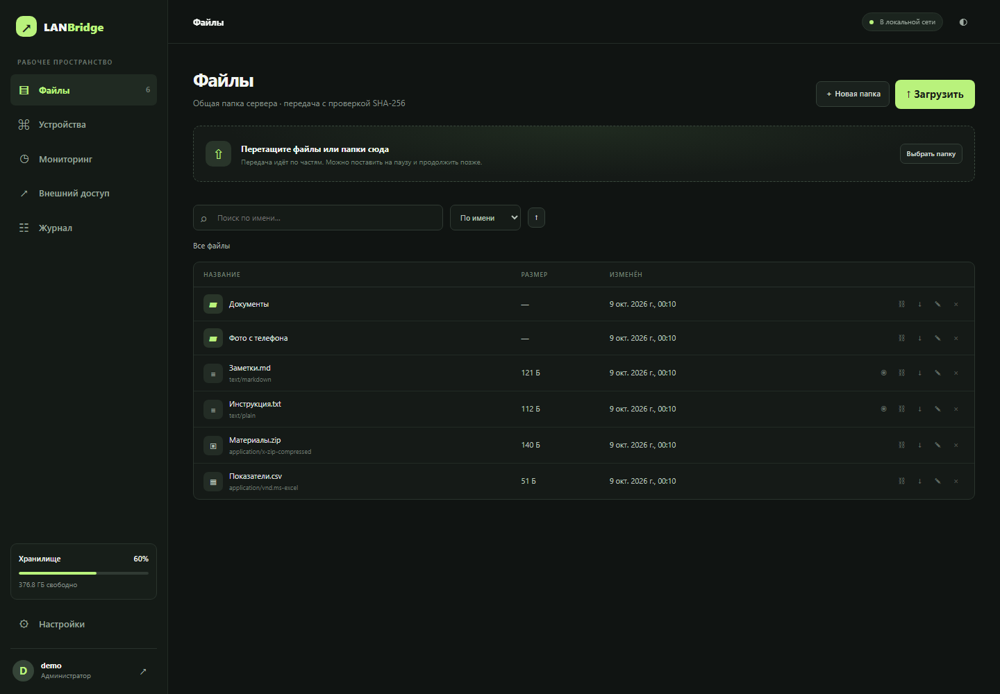
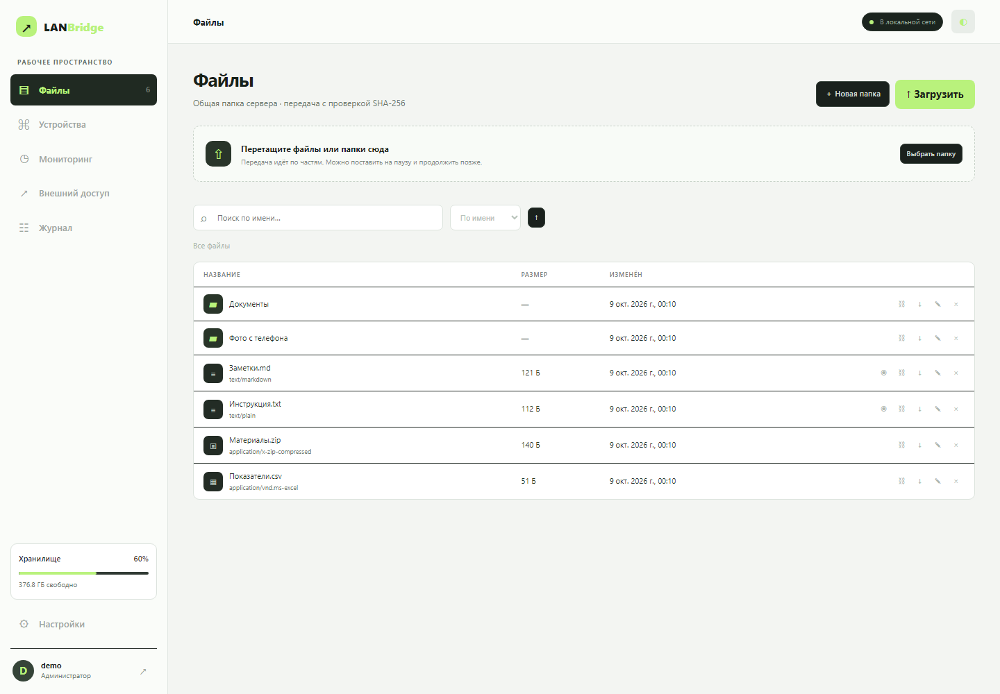
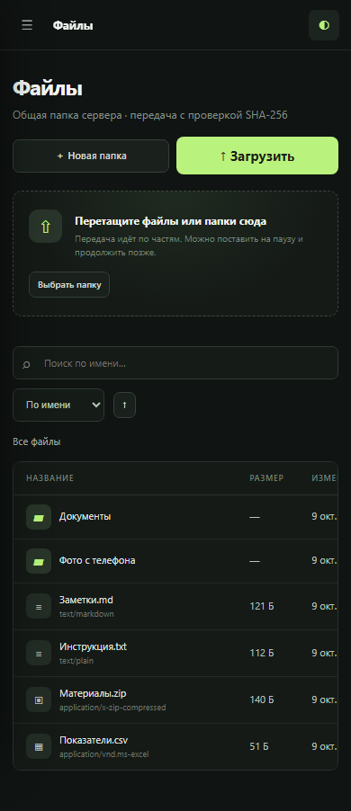
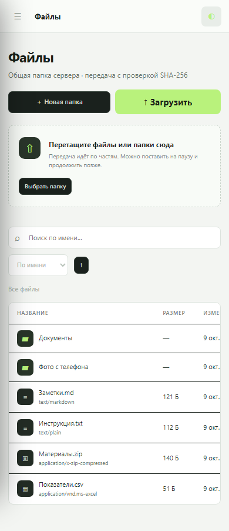
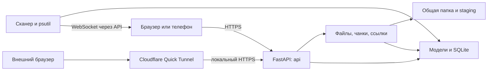

# LANBridge

[](CHANGELOG.md) [](LICENSE)  

LANBridge — приложение для обмена файлами между компьютером, телефоном и другими устройствами в локальной сети через браузер. Оно запускается на вашем компьютере, хранит файлы в выбранной папке и показывает состояние сервера, сети и передач. Для временного доступа предусмотрены гостевые ссылки и подключение Cloudflare Quick Tunnel.

**Запуск из папки проекта:** `python run.py`. **Адрес на компьютере:** [https://localhost:8765](https://localhost:8765). Node.js и отдельная сборка интерфейса не нужны.

<a id="about"></a>
## 1. Состояние проекта

Версия разработки: **0.1.0-dev.1**. Основное проверенное окружение — Windows 11 и Python 3.14.4. Linux и Docker предусмотрены, но их запуск пока не подтверждён.

Последняя проверка на Windows: 14 unit-тестов, HTTPS-запуск, API загрузки и докачки, SHA-256, HTTP Range, сессии, роли и гостевые ссылки. Проверены навигация интерфейса, две темы при ширине 1440 и 390 px, WebSocket и 40 принудительных обрывов TCP; в этих сценариях ошибок в журнале не обнаружено. Проверки используют временные данные. Это не заменяет испытания на физическом телефоне, передачу 5+ ГиБ и независимую проверку безопасности. Подробнее — в [протоколе проверки](docs/verification.md).

[Возможности](#features) · [Скриншоты](#screenshots) · [Требования](#requirements) · [Быстрый старт](#quickstart) · [Первая настройка](#setup) · [Конфигурация](#configuration) · [Использование](#usage) · [Внешний доступ](#external) · [Безопасность](#security) · [Архитектура](#architecture) · [API](#api) · [Разработка](#development) · [FAQ](#faq) · [Roadmap](#roadmap)

<a id="features"></a>
## 2. Возможности

### Файлы

- Drag-and-drop файлов и папок, очередь из двух одновременных загрузок, прогресс, скорость и оставшееся время.
- Загрузка частями, пауза и повторное использование принятых частей после обрыва; потоковая запись и SHA-256 собранного файла.
- Общая папка: поиск, сортировка, создание каталогов, переименование, удаление, ZIP-скачивание папок, предпросмотр текста, изображений и видео.
- HTTP Range для продолжения скачивания; временные ссылки на файл или каталог с TTL, паролем и лимитом запросов скачивания.
- Адаптивный интерфейс и QR-код текущего адреса сервера.

### Мониторинг

- CPU, RAM, свободный диск, скорости сетевых интерфейсов, активные передачи и WebSocket-обновления.
- Устройства из ARP/neighbour cache ОС: IP, MAC, имя, последнее появление, состояние и объём данных через сервис. База OUI небольшая.
- Ping, DNS, traceroute, тест загрузки 8 МиБ из браузера на сервер.
- История передач с фильтрами и CSV; графики CPU/RAM за час, сутки и неделю; предупреждения о диске, пропавших устройствах, зависшей передаче и серии неудачных входов.

### Внешний доступ

- Cloudflare Quick Tunnel: запуск и остановка дочернего процесса, временный URL, время работы, счётчики запросов и байт.
- При каждом старте туннель выключен. Отсутствующий `cloudflared` приводит к понятной ошибке без открытия доступа.
- NetBird и reverse proxy имеют интерфейс провайдера, но не управляются этой версией. Статус и ручные варианты подключения описаны [отдельно](docs/external-access.md).

### Безопасность

- Первый администратор, пользователи, гостевые ссылки; Argon2, ограниченные по времени сессии, CSRF и same-origin проверки.
- HTTPS с автоматически создаваемым локальным сертификатом или парой собственных PEM-файлов.
- Проверка путей и расширений, ограничения размера, защита входа и гостевых паролей от перебора, аудит действий.
- Данные, ключи, `.env`, логи и рабочий `config.yaml` исключены из Git и Docker build context.

<a id="screenshots"></a>
## 3. Скриншоты

Реальные снимки Chromium с одноразовой учётной записью `demo` и демонстрационными файлами. Рабочие пользовательские данные в них не используются. Ширина десктопа — 1440 px, мобильного экрана — 390 px; таблица на узком экране прокручивается горизонтально.

| Десктоп: тёмная тема | Десктоп: светлая тема |
|---|---|
|  |  |

| Мобильный экран: тёмная тема | Мобильный экран: светлая тема |
|---|---|
|  |  |

<a id="requirements"></a>
## 4. Требования

| Компонент | Требование |
|---|---|
| ОС | Windows 11; Linux предусмотрен кодом, ожидает отдельной проверки |
| Python | 3.11 или новее с `pip` и `venv`; проверено на Python 3.14 |
| Git | Не нужен для запуска из готовой папки; используется при работе с репозиторием |
| Node.js | Для запуска приложения не нужен; Node 20+ можно использовать для `node --check` |
| Браузер | Современный Chrome/Edge/Firefox/Safari; поддержка выбора папок зависит от браузера |
| Порт | TCP 8765 по умолчанию; HTTPS и WebSocket используют один порт |
| Диск | Место для файлов, SQLite и staging; при сборке нужно примерно два размера загружаемого файла |
| Сеть | Для первого скачивания Python-зависимостей нужен интернет; затем LAN-режим работает локально |
| Права | Сам сервер запускается без администратора; установка системных утилит и настройка firewall могут требовать повышенных прав |

Сканер читает таблицу соседей, а не перехватывает пакеты. Для диагностики нужны системные `ping`, `arp`/`ip`, `tracert`/`traceroute`. В Linux пакет для `venv` иногда устанавливается отдельно. Docker-образ включает сетевые утилиты, но видит сеть и ресурсы своего окружения, а не всю домашнюю сеть.

<a id="quickstart"></a>
## 5. Быстрый старт

Сохраните проект в отдельную папку и откройте в ней терминал. В текущем каталоге должен находиться `run.py`. Все команды ниже выполняются из этой папки; её название может быть `lanbridge`, `lanbridge-clean` или другим. Публикация на GitHub для запуска не требуется.

### Windows 11 — PowerShell

```powershell
python run.py
```

Дождитесь сообщения о запуске и откройте [https://localhost:8765](https://localhost:8765). При первом запуске скрипт создаёт `.venv`, устанавливает зависимости, копирует `config.example.yaml` в отсутствующий `config.yaml` и создаёт SQLite и локальный сертификат. Первый запуск требует интернета для установки пакетов. Остановка — `Ctrl+C`; повторный запуск — та же команда. Терминал с сервером должен оставаться открытым.

Браузер может показать предупреждение о сертификате: автоматически созданный сертификат не имеет доверенного издателя. Настройка HTTPS описана в [разделе первой настройки](#setup).

Установка отдельно от запуска и проверка запуска на временных данных:

```powershell
python run.py --install-only
python run.py --check
```

Обёртки из `scripts/` выполняют те же действия:

```powershell
.\scripts\install.ps1
.\scripts\start.ps1
.\scripts\generate-cert.ps1
```

Если политика PowerShell запрещает локальные `.ps1`, используйте `python run.py`; менять системную политику для приложения не требуется.

### Linux

Эти команды и POSIX-сценарии подготовлены для Linux; сценарии проверены через Git Bash на Windows, но запуск Linux ещё не подтверждён.

```bash
python3 run.py
```

```bash
sh scripts/install.sh
sh scripts/start.sh
sh scripts/generate-cert.sh
```

### Docker Compose

Нужен Docker Engine с Compose v2 или Docker Desktop. В этой среде проверена структура YAML; сборка и запуск контейнера ожидают среды с Docker.

```bash
docker compose config --quiet
docker compose up --build
```

Адрес входа — [https://localhost:8765](https://localhost:8765). Данные сохраняются в именованном volume `lanbridge-data`. Остановить стек с сохранением данных:

```bash
docker compose down
```

Compose монтирует `config.example.yaml` как `/app/config.yaml`, закрепляет внутренний порт 8765 и публикует его на `${LANBRIDGE_PORT:-8765}` хоста. Для личной конфигурации скопируйте образец в `config.yaml` и замените источник этого mount в Compose. Папки хранения должны оставаться под `/app/data`, поскольку остальная файловая система контейнера доступна только для чтения. `cloudflared` в образ не включён. Подробности и ограничения контейнера — в [архитектуре](docs/architecture.md).

<a id="setup"></a>
## 6. Первая настройка

1. На доверенной локальной сети откройте сервер и создайте администратора: логин из латинских букв, цифр, `_`, `.` или `-`, пароль не короче 12 символов. Для изолированного первого запуска можно временно указать `server.host: 127.0.0.1`.
2. В `config.yaml` задайте `storage.root`: по умолчанию это `./data/files`. Относительные пути считаются от корня репозитория. Пользователь процесса должен иметь право записи. Изменение пути не переносит старые файлы: остановите сервер, перенесите их и только затем перезапустите.
3. При первом HTTPS-запуске создаются `data/tls/lanbridge.crt` и `lanbridge.key`. Браузер предупредит о неизвестном издателе. Доверяйте сертификату только после проверки, что открываете свой компьютер.
4. Для собственного сертификата задайте одновременно `server.tls_certfile` и `server.tls_keyfile`. SAN сертификата должен включать используемое имя/IP. Сертификат и ключ не добавляются в Git.
5. Дополнительные учётные записи создаются в «Настройки». Пользователи имеют общий файловый раздел; отдельного ACL на каждый файл нет.

Сценарий генерации сертификата не заменяет существующую пару. Если IP изменился, подготовьте новую пару отдельно и укажите её в конфигурации. Существующая база сохраняет учётные записи при повторном запуске; форма создания первого администратора появляется только для пустой базы.

### Как убрать предупреждение «Подключение к сайту не защищено»

Автоматический сертификат обеспечивает TLS, но браузер не может подтвердить его издателя. Временное исключение в браузере не делает сертификат доверенным.

Для локальной сети используйте сертификат от собственного доверенного центра сертификации:

1. Создайте локальный центр сертификации или используйте существующий.
2. Добавьте его **корневой сертификат** в доверенное хранилище устройства, с которого открываете приложение. На телефоне это делается отдельно. Приватный ключ центра на клиентские устройства не копируется.
3. Выпустите серверный сертификат с SAN для используемых адресов: `localhost`, `127.0.0.1` и локального IP компьютера. Для IP нужен SAN типа IP Address.
4. Укажите пути к PEM-сертификату и его приватному ключу в существующем разделе `server` файла `config.yaml`, затем перезапустите сервер и браузер.

Пример значений внутри раздела `server` после подготовки файлов:

```yaml
https: true
tls_certfile: ./data/tls/server.crt
tls_keyfile: ./data/tls/server.key
```

Файлы из примера не создаются автоматически: стандартная пара называется `lanbridge.crt` и `lanbridge.key`. Приложение само не создаёт центр сертификации и не меняет системное хранилище доверия. Для отсутствия предупреждения должны одновременно выполняться три условия: доверенный издатель, действующий срок и соответствие имени/IP в адресной строке сертификату. Отключать HTTPS для устранения предупреждения не требуется.

<a id="configuration"></a>
## 7. Конфигурация

Источник по умолчанию — [config.example.yaml](config.example.yaml), рабочая копия — игнорируемый `config.yaml`. Приоритет: переменные процесса → значения `.env` → YAML. Для YAML-параметров, не перечисленных в таблице `.env`, переменных окружения нет. После изменения параметров перезапустите сервер.

| Параметр YAML | По умолчанию | Описание |
|---|---|---|
| `server.host` | `0.0.0.0` | Адрес привязки; `127.0.0.1` ограничивает доступ этим ПК |
| `server.port` | `8765` | TCP-порт HTTP(S) и WebSocket |
| `server.https` | `true` | TLS; `false` предназначено только для локальной разработки |
| `server.tls_certfile` | `""` | PEM-сертификат; пусто — использовать автоматически созданный |
| `server.tls_keyfile` | `""` | PEM-ключ; задаётся вместе с сертификатом |
| `server.max_upload_bytes` | `1099511627776` | Лимит одного файла, 1 ТиБ; это ограничение API, не подтверждённый размер испытаний |
| `server.chunk_size` | `8388608` | Чанк 8 МиБ; приложение ограничивает диапазоном 256 КиБ–64 МиБ |
| `server.session_days` | `7` | Срок сессии в сутках |
| `storage.root` | `./data/files` | Общая папка и скрытые временные части |
| `storage.database` | `./data/lanbridge.sqlite3` | SQLite; один сервер на одну базу |
| `storage.tls_dir` | `./data/tls` | Каталог автоматически создаваемой пары TLS |
| `storage.logs` | `./data/logs` | Каталог журналов; основной лог 5 МиБ и 5 резервных файлов |
| `security.allowed_extensions` | `[]` | Пусто — разрешены типы вне запретного списка; непустой список допускает только указанные расширения |
| `security.blocked_extensions` | `exe, dll, com, bat, cmd, ps1, psm1, sh, bash, zsh, msi, msp, scr, cpl, sys, pif, jar, js, jse, mjs, vbs, vbe, wsf, wsh, hta, reg, lnk, appx, msix` | Запрещённые расширения, без точки; проверка не является антивирусом |
| `security.login_attempts` | `8` | Число неудачных попыток входа с одного IP до HTTP 429 |
| `security.login_window_minutes` | `15` | Окно подсчёта попыток |
| `tunnel.provider` | `cloudflare` | `cloudflare`, `netbird`, `reverse_proxy`; последние два не реализуют запуск |
| `tunnel.cloudflared_binary` | `cloudflared` | Имя в PATH или полный путь к исполняемому файлу |
| `tunnel.origin_url` | `""` | Пусто — локальный адрес из `server.port`; явный адрес допускает только HTTPS и loopback |
| `monitoring.history_days` | `30` | Хранение метрик, ограничено 1–365 днями |
| `monitoring.sample_seconds` | `3` | Период сбора, ограничен 2–60 секундами; WebSocket передаёт данные каждые 3 секунды |

Устаревший ключ `tunnel.enabled_at_start` не используется: туннель всегда выключен после старта. Архив метрик записывается примерно раз в минуту; аудит старше 365 дней удаляется автоматически. Подробности — в [архитектуре](docs/architecture.md).

| Переменная окружения | По умолчанию | Описание |
|---|---|---|
| `LANBRIDGE_CONFIG` | `config.yaml` | Путь к YAML; явно указанный файл должен существовать |
| `LANBRIDGE_ENV_FILE` | `.env` | Альтернативный dotenv-файл; задавайте эту переменную до запуска |
| `LANBRIDGE_HOST` | из YAML | Переопределяет `server.host` |
| `LANBRIDGE_PORT` | из YAML | Переопределяет `server.port`; в Compose задаёт внешний порт |
| `LANBRIDGE_CLOUDFLARED` | из YAML | Переопределяет путь к `cloudflared` |
| `LANBRIDGE_TLS_CERTFILE` | из YAML | Переопределяет PEM-сертификат |
| `LANBRIDGE_TLS_KEYFILE` | из YAML | Переопределяет PEM-ключ |
| `LANBRIDGE_USE_VENV` | не задана | Внутренний параметр bootstrap/контейнера: `1` пропускает создание `.venv`; обычно вручную не нужен |
| `LANBRIDGE_PYTHON` | `python3` | Только для `.sh`: выбирает интерпретатор обёртки |

Шаблон окружения: [.env.example](.env.example). Пароль администратора задаётся в интерфейсе и хранится в БД как Argon2-хеш; пароля в конфигурации нет.

<a id="usage"></a>
## 8. Использование

**Передача.** Откройте «Файлы», перетащите файлы/каталог или используйте «Загрузить». Пауза останавливает передачу между чанками. После закрытия вкладки войдите заново и выберите тот же файл с прежним путём, размером и временем изменения: сервер вернёт принятые части. SHA-256 результата виден в истории. Для скачивания используйте стрелку вниз; браузер отвечает за сохранение и продолжение загрузки. На мобильном экране таблица прокручивается вправо до действий.

**Телефон и QR.** Подключите устройства к одной сети. Узнайте IPv4 компьютера в настройках ОС и откройте на компьютере `https://IP-компьютера:8765`, затем «Настройки → QR-код». QR кодирует адрес текущей вкладки: если открыть интерфейс через `localhost`, такой код не подойдёт телефону. Клиентская изоляция гостевого Wi-Fi может блокировать соединение.

**Временные ссылки.** Нажмите значок ссылки у файла/папки, выберите срок 1–720 часов, лимит 1–10000 и при необходимости пароль от 8 символов. Сохраните URL сразу: в БД хранится только хеш токена. Лимит учитывает HTTP-запросы скачивания, включая Range; повторное скачивание может расходовать ещё одну попытку. В «Настройках» ссылку можно отозвать. Пароль передавайте отдельно от URL.

**Дашборд.** CPU/RAM и диск описывают сервер, сетевые скорости — его интерфейсы, а не весь трафик роутера. Основные карточки обновляются через WebSocket; таблица интерфейсов и график обновляются при открытии страницы/смене периода. История появляется по мере накопления данных. Пропавшим считается ранее известное устройство, давно отсутствующее в наблюдениях. «Тест LAN» измеряет передачу 8 МиБ на сервер и не является тестом интернет-канала. В «Журнале» фильтры передач применяются и к CSV; экспорт ограничен 500 последними подходящими записями.

<a id="external"></a>
## 9. Внешний доступ

Для Cloudflare: установите официальный `cloudflared`, укажите его путь, перезапустите LANBridge, войдите администратором и включите «Открыть доступ снаружи». Дождитесь URL и проверьте его с устройства вне Wi-Fi. Для отключения используйте тот же переключатель; остановка сервера также завершает управляемый процесс. Quick Tunnel даёт временный адрес без гарантии доступности; правила провайдера описаны в [документации Cloudflare](https://developers.cloudflare.com/tunnel/get-started/quick-tunnels/).

Пошаговые инструкции, установка для Windows/Linux, состояния NetBird/reverse proxy и NAT/CGNAT — в [docs/external-access.md](docs/external-access.md). «Проверить сеть» обращается к Cloudflare для определения внешнего IP. Частный IP сервера не позволяет надёжно распознать CGNAT маршрутизатора; нужно сравнить WAN IP роутера с внешним. Проверка не подтверждает доступность порта из интернета.

Публичный туннель делает страницу входа доступной извне. Гостевой URL ограничивает права получателя заданным объектом, но отдельного режима публикации только гостевых маршрутов в этой версии нет. Переключатель управляет только дочерним `cloudflared`: самостоятельно настроенные VPN, proxy и пробросы портов им не отключаются. Не публикуйте административный сервер без изучения [модели угроз](docs/security.md).

<a id="security"></a>
## 10. Безопасность

- Доверенная граница — ОС сервера и его администратор. Доступ к ключу, БД или файлам на диске позволяет обойти защиту приложения.
- `admin` управляет пользователями, аудитом и туннелем. `user` работает с общей папкой и своими передачами/ссылками. `guest` использует только объект bearer-ссылки.
- Сессии хранятся в cookie с `HttpOnly`, `SameSite=Strict` и `Secure` при HTTPS; в SQLite лежат хеши случайных токенов. Изменяющим запросам нужен CSRF-заголовок.
- Аудит включает входы, операции с файлами, ссылки и туннель. Имена файлов, IP и имена пользователей являются чувствительными данными; HTTP access-log может содержать URL гостевой ссылки.
- До внешнего доступа используйте отдельную папку с нужными файлами, уникальные пароли, ограниченный allowlist расширений, актуальные зависимости, резервную копию и firewall. Не выдавайте роль `user` человеку, которому нельзя доверить все файлы общей папки.

Локальная фильтрация IP не заменяет firewall: proxy/NAT могут скрыть настоящий адрес клиента. Нет общей защиты от DoS, пользовательских квот, антивируса и независимого аудита безопасности. Подробности, резервное копирование и отзыв доступа — в [docs/security.md](docs/security.md).

<a id="architecture"></a>
## 11. Архитектура



Backend разделён на `api`, `services`, `models`, `network` и `tunnels`; frontend — статические HTML/CSS/JavaScript без отдельной сборки Node. Хеширование и системная диагностика выполняются вне основного цикла API. [Архитектура и потоки данных](docs/architecture.md) описывают сборку файлов, хранение метрик, TLS и ограничения одного процесса.

<a id="api"></a>
## 12. API

При работающем сервере доступны [Swagger UI `/docs`](https://localhost:8765/docs) и [OpenAPI JSON](https://localhost:8765/openapi.json). При изменении порта измените адрес. Вызовы защищённых маршрутов требуют сессии; Swagger сам по себе не выдаёт прав.

Проверка состояния в PowerShell; `--insecure` нужен только для локального самоподписанного сертификата:

```powershell
curl.exe --insecure https://localhost:8765/api/status
```

Пример ответа до настройки:

```json
{"setup_required": true, "authenticated": false, "user": null}
```

Проверенный клиент на стандартной библиотеке Python запрашивает логин/пароль интерактивно, читает файлы и метрики, затем завершает сессию:

```powershell
python scripts/api_example.py --self-signed
```

Маршруты, заголовки, возобновление загрузки, Range и гостевой API — в [docs/api.md](docs/api.md).

<a id="development"></a>
## 13. Разработка

Установка инструментов и запуск с перезагрузкой backend:

```powershell
python run.py --with-dev --install-only
python run.py --dev
```

Изменения HTML/CSS/JS видны после обновления страницы. Для проверки остановите dev-сервер или используйте второе окно: smoke поднимает отдельный сервер на случайном loopback-порту и временной базе.

```powershell
python run.py --check
python run.py --test
python run.py --lint
.venv\Scripts\python.exe scripts/verify_api.py
.venv\Scripts\python.exe -m playwright install chromium
.venv\Scripts\python.exe scripts/verify_disconnects.py
python scripts/check_repository.py
.venv\Scripts\python.exe scripts/check_docs.py
node --check frontend/app.js
node --check frontend/auth.js
node --check frontend/guest.js
```

Снимки интерфейса воспроизводятся после установки Chromium для Playwright. Скрипт создаёт и удаляет собственные временные данные:

```powershell
.venv\Scripts\python.exe -m playwright install chromium
.venv\Scripts\python.exe scripts/screenshots.py
```

В Linux путь интерпретатора среды — `.venv/bin/python`; этот вариант ещё не запускался в Linux. Ruff проверяет Python, `node --check` — синтаксис JavaScript. Скрипт проверки репозитория ищет частные пути и распознаваемые ключи в индексе Git; он не заменяет полноценный secret scanner.

```text
lanbridge/
├── backend/
│   ├── api/          # HTTP и WebSocket
│   ├── services/     # файлы, чанки, ссылки
│   ├── models/       # запросы API и SQLite
│   ├── network/      # ARP, метрики, диагностика
│   ├── tunnels/      # провайдеры
│   └── tests/        # критические файловые сценарии
├── frontend/         # HTML, CSS, JavaScript
├── docs/             # архитектура, безопасность, API, скриншоты
├── scripts/          # установка, запуск, сертификаты, проверки
├── config.example.yaml
├── docker-compose.yml
├── Dockerfile
├── run.py
└── README.md
```

При работе с Git используются `main` для стабильной версии, `dev` для разработки и `feature/<название>` для крупных изменений. Формат коммитов — Conventional Commits (`feat:`, `fix:`, `docs:`, `test:`, `refactor:`, `chore:`), английский заголовок до 72 символов. Перед коммитом проверяйте запуск через `python run.py --check`. Локальная работа приложения не зависит от Git или удалённого репозитория.

На Windows модуль `backend/network/asyncio_compat.py` завершает очистку Proactor-транспорта после `ConnectionResetError` с WinError 10054 в callback закрытия. Остальные ошибки продолжают передаваться стандартному обработчику. Проверка `verify_disconnects.py` моделирует резкое закрытие HTTPS-соединений, перезагрузки страниц и работу WebSocket.

<a id="faq"></a>
## 14. Решение проблем

| Симптом | Что проверить |
|---|---|
| Порт занят | Остановите предыдущий экземпляр или измените `server.port`/`LANBRIDGE_PORT`; не запускайте два сервера на одну SQLite-базу |
| Телефон не подключается | Используйте IP компьютера вместо localhost; проверьте одну сеть, отсутствие изоляции Wi-Fi и профиль firewall |
| Брандмауэр Windows | В «Безопасность Windows → Брандмауэр» разрешите Python/TCP-порт только для нужной частной сети; приложение само правил не создаёт |
| Устройства не находятся | ARP cache заполняется при сетевом общении; откройте LANBridge с другого устройства и обновите список. VPN, контейнер и Wi-Fi isolation ограничивают видимость |
| Устройство показано онлайн после отключения | Кэш ОС может хранить соседа; список не является гарантированной активной проверкой каждого хоста |
| Сертификат не доверен | Настройте доверенного издателя, правильный SAN и действующий срок; порядок действий — в [настройке HTTPS](#setup). Наличие HTTPS само по себе не означает доверия браузера |
| `ERR_CONNECTION_REFUSED` | Запустите `python run.py` и дождитесь сообщения о запуске; проверьте порт и адрес. Открытая вкладка браузера не запускает сервер |
| `WinError 10054` после HTTP 200 | Клиент мог резко закрыть соединение. Для callback Proactor добавлена обработка очистки; после обновления перезапустите сервер. Если traceback повторяется, сохраните полный текст: другие источники ошибки не скрываются |
| Туннель не запускается | Проверьте путь к cloudflared, HTTPS origin, исходящую сеть и текст ошибки. NetBird/reverse_proxy не реализуют управляемый запуск |
| HTTP 401 / 403 | Войдите снова; для POST/PUT/DELETE нужны cookie и актуальный CSRF. Изменение hostname создаёт отдельный cookie-контекст |
| HTTP 409 при загрузке | Файл уже существует или загрузка не собрана полностью. Смените имя либо выберите прежний файл для возобновления |
| HTTP 413 | Превышен лимит файла или неверен размер чанка; проверьте `server.max_upload_bytes` и свободный диск |
| HTTP 429 | Достигнут лимит попыток входа; дождитесь окончания окна ограничения |
| После переноса нет старых файлов | Проверьте `storage.root` и путь к БД. Git не переносит `data`, `.env`, `config.yaml` и сертификаты; восстановите их отдельно из резервной копии |
| Docker показывает только свою сеть | Bridge-сеть изолирована от ARP-таблицы хоста. Для полной видимости хоста используйте обычный запуск на ОС |

<a id="roadmap"></a>
## 15. Roadmap, лицензия и благодарности

До `v0.1.0` необходимы: испытания передачи 5+ ГиБ с телефона и второго ПК с обрывом/продолжением; реальная проверка включения и остановки Cloudflare; запуск Linux/Docker; проверка безопасности перед внешней публикацией. Семантическая версия хранится в [VERSION](VERSION), изменения — в [CHANGELOG.md](CHANGELOG.md). Релизный тег ставится только после закрытия критериев, а не по факту оформления документации.

Дальнейшая работа: mDNS, расширенная OUI-база, отправка на выбранный клиент, отдельная публикация гостевых маршрутов, управление NetBird/reverse proxy, ACL/квоты, локализация строк, thumbnail-кэш и автоматизация проверки нескольких ОС.

Лицензия — [MIT](LICENSE). Проект использует FastAPI, Uvicorn, Starlette, Pydantic, SQLite, psutil, argon2-cffi, cryptography, PyYAML и qrcode; Ruff и Playwright помогают проверять код и интерфейс. Их лицензии сохраняются у соответствующих проектов.
