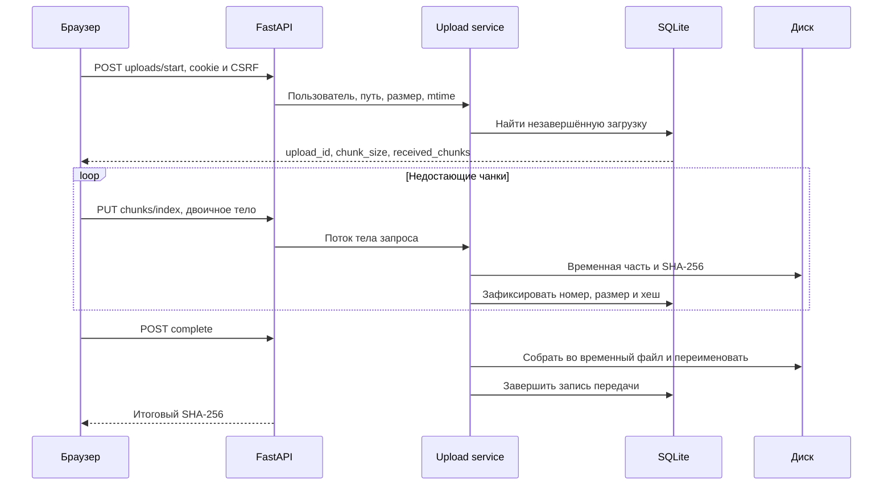

# Архитектура LANBridge

[README](../README.md) · [Безопасность](security.md) · [API](api.md)

## Слои

| Каталог | Ответственность |
|---|---|
| `backend/api/app.py` | Маршруты FastAPI, аутентификация запросов, ответы с файлами, WebSocket, запуск TLS |
| `backend/models/schemas.py` | Pydantic-модели входных запросов |
| `backend/models/database.py` | Подключения SQLite, схема, идемпотентные обновления колонок |
| `backend/services/` | Безопасные пути, файловые операции, чанки, сборка, гостевые ссылки |
| `backend/network/` | Таблица соседей, reverse DNS, системные команды, сбор метрик и предупреждения |
| `backend/tunnels/` | Контракт провайдера, управляемый Cloudflare-процесс, недоступные NetBird/proxy адаптеры |
| `backend/security.py` | Cookie-сессии, Argon2, CSRF и аудит |
| `backend/config.py` | YAML, dotenv и переменные процесса; разрешение относительных путей |
| `frontend/` | HTML/CSS/JavaScript, очередь загрузок, интерфейс, canvas-график и гостевая страница |
| `scripts/` | Установка, запуск, проверки, API-пример и воспроизводимые скриншоты |

Статический frontend выбран для запуска без npm и отдельного frontend-сервера. Это обычные browser scripts, а не React/Vite-проект. Строки интерфейса сейчас русские и встроены в JavaScript/HTML; отдельный i18n-каталог ещё не выделен.

## Запуск и состояние

`run.py` создаёт `.venv`, передаёт в неё запуск и устанавливает отсутствующие зависимости. `--with-dev` дополнительно ставит Ruff и Playwright. При импорте конфигурации отсутствующий стандартный `config.yaml` создаётся из образца; явно заданный `LANBRIDGE_CONFIG` не создаётся автоматически.

Сервер создаёт каталоги хранения, инициализирует SQLite, настраивает ротацию логов, подготавливает TLS и запускает Uvicorn. Предназначен для **одного процесса сервера на одну базу**. Несколько workers или независимых экземпляров на одном storage не поддерживаются: блокировки завершения загрузок и состояние туннеля находятся в памяти процесса.

При закрытии приложения фоновая задача мониторинга отменяется, управляемый туннель останавливается. Жёсткое завершение процесса средствами ОС может прервать текущие операции; используйте штатный `Ctrl+C`. Состояние включённого туннеля не сохраняется между запусками.

## Файлы и память

В браузере одновременно передаются два файла. Файл разбивается через `File.slice`; сервер принимает тело потоком и пишет `.lanbridge-staging`. Размер части по умолчанию 8 МиБ, диапазон настройки — 256 КиБ–64 МиБ. Полный файл не собирается в RAM.

Возобновление сопоставляет пользователя, относительный путь, размер и `lastModified`. Браузер после перезапуска не получает доступ к прежнему файлу автоматически — его нужно выбрать повторно. Новый файл с тем же именем, размером и временем изменения не распознаётся как другая версия по содержимому до проверки частей; для изменённого файла задайте новый путь.

При завершении части читаются последовательно, проверяются и копируются во временный файл; считается полный SHA-256. Затем происходит переименование на файловой системе и запись результата в SQLite. Для этого нужно дополнительное место примерно с размер файла. Переименование и транзакция БД не образуют единую транзакцию: аварийная остановка между ними требует ручной проверки файла и истории.

Скачивание отдельного файла поддерживает один диапазон HTTP Range. ZIP каталога предварительно собирается на диске в `.lanbridge-exports`; это также требует свободного места. Каталоги staging/exports скрыты от менеджера. Symlink, `..`, абсолютные пути, служебные имена Windows и выход за корень отклоняются.

## База и сроки хранения

Таблицы: пользователи, сессии, попытки входа, загрузки, чанки, передачи, ссылки, гостевые сессии/попытки, аудит, устройства, метрики и оповещения. SQLite работает в WAL-режиме с foreign keys. Обновление схемы — `CREATE TABLE IF NOT EXISTS` и проверки колонок; Alembic и откат миграций не подключены. Перед обновлением версии нужна резервная копия.

| Данные | Очистка |
|---|---|
| Метрики | По `monitoring.history_days`, по умолчанию 30 дней |
| Аудит | Старше 365 дней |
| Оповещения | Старше 180 дней |
| Попытки логина/гостевого пароля | Старше 60 дней |
| Гостевые сессии | После окончания срока |
| История передач, пользователи, ссылки | Автоматическое полное удаление не настроено |

Истёкшая сессия доступа отклоняется даже до удаления её записи. Операционный лог ротируется при 5 МиБ, хранится до пяти резервных файлов. HTTP access-log Uvicorn выводится в консоль.

## Мониторинг

`psutil` собирает общие и покомпонентные сетевые счётчики, CPU, RAM и диск. Частота сбора 2–60 секунд; агрегат сохраняется примерно раз в минуту. WebSocket `/api/ws` каждые три секунды отправляет актуальные метрики и активные передачи. Основные карточки UI обновляются сразу; таблица интерфейсов и исторический график сейчас обновляются при открытии страницы/смене периода.

Таблица соседей ОС читается примерно каждые 30 секунд. Reverse DNS выполняется в daemon-потоках с кэшем: медленный DNS не задерживает ответ сканера; имя может появиться в следующем обновлении. Наличие записи ARP не доказывает текущую доступность устройства. Клиенты, обращавшиеся к сервису, тоже учитываются. Полного активного сканирования, mDNS и мониторинга чужих соединений нет.

Оповещения: меньше 5 ГиБ свободного диска либо 92% занято; приём файла без продвижения более 120 секунд; исчезновение известного устройства; три неудачных входа за 15 минут. Предупреждение о передаче означает отсутствие прогресса, а не анализ падения скорости относительно базовой линии.

## Туннели и контейнер

Cloudflare-адаптер запускает локальный `cloudflared`, извлекает временный URL из вывода, считает запросы и потоковые байты, завершает свой процесс при выключении. Другие адаптеры возвращают сообщение о неподдерживаемой настройке. Ограничения источников и доверия к proxy изложены в [модели угроз](security.md).

Dockerfile использует Python 3.12, непривилегированного пользователя 10001 и отдельный `/app/data`. Compose делает корневую файловую систему read-only, оставляет `/tmp` в tmpfs, сохраняет named volume и даёт `NET_RAW` для сетевой диагностики. Сборка и поведение этих ограничений пока не проверены на движке Docker.

В bridge-сети IP клиента может заменяться адресом шлюза. ARP, интерфейсы, CPU/RAM и DNS описывают среду процесса и могут отличаться от хоста; ограничение попыток входа по IP может объединять разных клиентов. Существующее содержимое `data` автоматически в volume не копируется. Для точной картины Windows-хоста используйте обычный Python-запуск.
